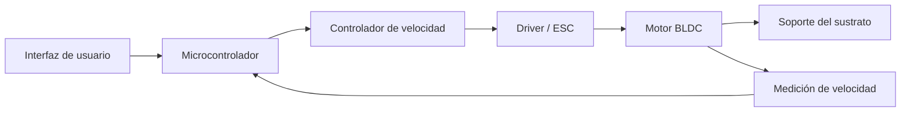
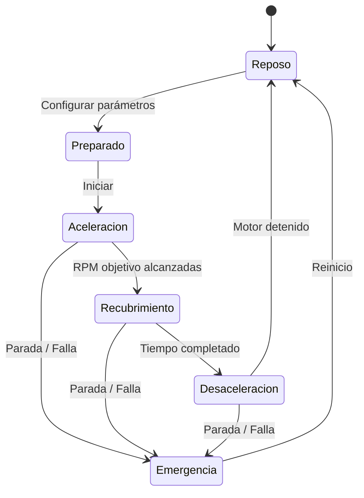

# Spin Coater

<p align="center">
  
</p>

<p align="center">
  <b>Desarrollo de un sistema Spin Coater de bajo costo con control de velocidad en lazo cerrado.</b>
</p>

---

## Descripción general

Este proyecto consiste en el diseño y desarrollo de un **Spin Coater**, un instrumento de laboratorio utilizado para depositar películas delgadas y uniformes sobre sustratos planos mediante su rotación a velocidades angulares controladas.

El sistema se desarrolla como parte del curso de **Proyecto de Instrumentación** e integra diseño mecánico, electrónica, programación embebida, instrumentación y control automático.

El objetivo principal es construir un Spin Coater funcional capaz de mantener una velocidad de rotación definida por el usuario, controlando parámetros importantes del proceso como:

- Velocidad de rotación.
- Aceleración.
- Tiempo de recubrimiento.
- Secuencia de arranque y parada del motor.
- Estabilidad de velocidad bajo diferentes cargas.

El proyecto toma como una de sus principales referencias técnicas al **Maasi Spin Coater**, un sistema de hardware abierto basado en un motor BLDC, un ESP32 y control de velocidad en lazo cerrado. :chatgpt-content-reference{index="0"}

---

## Objetivos del proyecto

Los principales objetivos del proyecto son:

- Diseñar y fabricar un sistema compacto para spin coating.
- Implementar el control electrónico de la velocidad del motor.
- Medir la velocidad real de rotación del sustrato.
- Implementar control de velocidad en lazo cerrado.
- Permitir al usuario configurar los parámetros del proceso.
- Diseñar soportes intercambiables para diferentes sustratos.
- Caracterizar la precisión y estabilidad de la velocidad de rotación.
- Evaluar el comportamiento del sistema bajo diferentes condiciones de operación.
- Documentar el hardware, firmware, diseño mecánico y validación experimental.

---

## Características principales

Las características previstas para el Spin Coater incluyen:

- Control de velocidad en lazo cerrado.
- RPM objetivo ajustables.
- Tiempo de recubrimiento configurable.
- Aceleración y desaceleración controladas.
- Medición de velocidad en tiempo real.
- Interfaz de usuario para configurar el proceso.
- Parada de emergencia.
- Cubierta de protección.
- Soporte intercambiable para sustratos.
- Caracterización experimental de RPM.

Algunas características adicionales podrán incorporarse durante el desarrollo del proyecto.

---

## Arquitectura del sistema

La arquitectura general del sistema se muestra a continuación.



El usuario selecciona las condiciones de operación mediante la interfaz.

El microcontrolador genera la señal de control para el motor y compara continuamente la velocidad medida con el valor de referencia.

A partir del error de velocidad, el algoritmo de control modifica la señal enviada al sistema de accionamiento del motor.

---

## Sistema de control

La principal variable controlada del sistema es la **velocidad de rotación del sustrato**.

| Parámetro | Descripción |
|---|---|
| Referencia o Setpoint | Velocidad de rotación deseada |
| Variable de proceso | Velocidad de rotación medida |
| Variable manipulada | Señal de control enviada al motor / ESC |
| Controlador | Por determinar |
| Estrategia | Control de velocidad en lazo cerrado |

El sistema de control será caracterizado experimentalmente mediante parámetros como:

- Error en estado estacionario.
- Tiempo de subida.
- Tiempo de establecimiento.
- Sobreimpulso.
- Estabilidad de velocidad.
- Respuesta ante cambios de carga.
- Respuesta ante cambios del setpoint de RPM.

Como referencia, el diseño Maasi implementa un controlador PID cuya actualización se realiza aproximadamente a 1 kHz utilizando la información de RPM recibida desde el ESC. :chatgpt-content-reference{index="1"}

---

## Especificaciones preliminares

| Parámetro | Objetivo / Estado |
|---|---|
| Velocidad mínima | Por determinar |
| Velocidad máxima | Por determinar |
| Resolución de RPM | Por determinar |
| Precisión de velocidad | Por determinar |
| Tiempo máximo de recubrimiento | Por determinar |
| Control de aceleración | Planificado |
| Control en lazo cerrado | Planificado |
| Tamaño máximo de sustrato | Por determinar |
| Tensión de alimentación | Por determinar |

Estas especificaciones serán actualizadas conforme se desarrolle y caracterice experimentalmente el prototipo.

---

## Hardware

El Spin Coater se divide en diferentes subsistemas de hardware.

### Electrónica de control

La electrónica de control incluirá:

- Microcontrolador.
- Driver del motor o controlador electrónico de velocidad.
- Sistema de alimentación y regulación.
- Sistema de medición de velocidad.
- Interfaz de usuario.
- Elementos de seguridad.

### Sistema de accionamiento

El sistema de accionamiento estará compuesto por:

- Motor eléctrico.
- Driver o ESC.
- Acoplamiento mecánico.
- Soporte giratorio del sustrato.

La configuración definitiva del motor y del sistema de accionamiento será documentada después de la selección de componentes y las pruebas experimentales.

### Medición de velocidad

La medición de velocidad permitirá implementar el control de velocidad en lazo cerrado.

Entre las alternativas consideradas se encuentran:

- Telemetría del ESC.
- Tacómetro óptico.
- Sensor de efecto Hall.
- Encoder óptico.

La implementación definitiva será documentada en este repositorio.

### Sistema de alimentación

El sistema de alimentación suministrará los niveles de tensión requeridos para:

- Motor.
- Driver o ESC.
- Microcontrolador.
- Sensores.
- Interfaz de usuario.

Los diagramas eléctricos correspondientes estarán disponibles en:

```text
Hardware/Electronics/
```

---

## Diseño mecánico

La estructura mecánica del Spin Coater incluye:

- Carcasa principal.
- Soporte del motor.
- Acoplamiento del eje.
- Soporte del sustrato.
- Recipiente de contención de líquidos.
- Tapa de protección.
- Sistema de montaje de la electrónica.

Los archivos CAD se almacenarán en:

```text
Hardware/Mechanical/CAD/
```

Los archivos destinados a fabricación, como STL, se almacenarán en:

```text
Hardware/Mechanical/STL/
```

Los planos técnicos se almacenarán en:

```text
Hardware/Mechanical/Drawings/
```

---

## Soporte del sustrato

El soporte del sustrato o **chuck** es el elemento encargado de mantener fija la muestra durante la rotación.

Su diseño debe proporcionar:

- Buen centrado mecánico.
- Baja vibración.
- Sujeción segura del sustrato.
- Fácil reemplazo de muestras.
- Compatibilidad con diferentes geometrías de sustratos.

Se podrán desarrollar diferentes diseños de soporte dependiendo de las muestras utilizadas durante las pruebas experimentales.

---

## Firmware

El firmware controla la secuencia completa de funcionamiento del Spin Coater.

Será responsable de:

- Leer los parámetros introducidos por el usuario.
- Generar la señal de control del motor.
- Medir la velocidad de rotación.
- Ejecutar el controlador de velocidad.
- Gestionar la aceleración y desaceleración.
- Controlar el tiempo de recubrimiento.
- Gestionar la interfaz de usuario.
- Implementar condiciones de seguridad.

Los archivos correspondientes estarán disponibles en:

```text
Firmware/
```

---

## Secuencia de operación

La secuencia preliminar de funcionamiento es:



La secuencia podrá modificarse durante el desarrollo del firmware.

---

## Lista de materiales

La lista completa de materiales o **Bill of Materials (BOM)** se mantendrá en:

```text
Hardware/BOM/
```

Una tabla preliminar de componentes es:

| Componente | Cantidad | Modelo / Especificación | Estado |
|---|---:|---|---|
| Microcontrolador | 1 | Por determinar | Selección |
| Motor | 1 | Por determinar | Selección |
| Driver / ESC | 1 | Por determinar | Selección |
| Fuente de alimentación | 1 | Por determinar | Selección |
| Sensor de velocidad | 1 | Por determinar | Selección |
| Interfaz de usuario | 1 | Por determinar | Selección |
| Soporte de sustrato | 1+ | Diseño propio | Diseño |
| Carcasa principal | 1 | Diseño propio | Diseño |
| Tapa de protección | 1 | Diseño propio | Diseño |

---

## Estructura del repositorio

```text
Spin-Coater/
│
├── README.md
├── LICENSE
├── .gitignore
│
├── Hardware/
│   ├── Electronics/
│   │   ├── Schematics/
│   │   ├── PCB/
│   │   └── Datasheets/
│   │
│   ├── Mechanical/
│   │   ├── CAD/
│   │   ├── STL/
│   │   └── Drawings/
│   │
│   └── BOM/
│
├── Firmware/
│
├── Documentation/
│   ├── Assembly/
│   ├── Operation/
│   ├── Testing/
│   └── References/
│
├── Media/
│   ├── Images/
│   └── Videos/
│
└── Results/
    ├── RPM/
    ├── Control/
    └── Coating/
```

---

## Ensamblaje

Las instrucciones detalladas de ensamblaje se añadirán conforme se finalicen los diseños mecánico y electrónico.

La documentación incluirá:

1. Ensamblaje de la estructura mecánica.
2. Instalación del motor.
3. Instalación del soporte de sustrato.
4. Montaje de la electrónica.
5. Conexiones eléctricas.
6. Instalación del sistema de medición de velocidad.
7. Instalación de la cubierta de protección.
8. Verificación inicial del sistema.

La documentación estará disponible en:

```text
Documentation/Assembly/
```

---

## Operación

El procedimiento preliminar de operación es:

1. Colocar el sustrato sobre el soporte.
2. Asegurar correctamente el sustrato.
3. Cerrar la tapa de protección.
4. Configurar la velocidad de rotación deseada.
5. Configurar el tiempo de recubrimiento.
6. Aplicar la solución de recubrimiento.
7. Iniciar la secuencia.
8. Esperar hasta que termine el tiempo programado.
9. Esperar hasta que el rotor se detenga completamente.
10. Abrir la tapa y retirar el sustrato.

El procedimiento definitivo se actualizará después de la validación del prototipo.

---

## Pruebas y caracterización

La validación experimental será una parte fundamental del proyecto.

### Caracterización de RPM

La velocidad de rotación medida será comparada con la velocidad configurada.

El error relativo de velocidad podrá evaluarse mediante:

\[
\text{Error de velocidad} =
\frac{\left|\text{RPM}_{set}-\text{RPM}_{medida}\right|}
{\text{RPM}_{set}}
\times 100
\]

Las pruebas se realizarán para diferentes velocidades de rotación.

### Pruebas con carga

El sistema también será evaluado bajo diferentes cargas para determinar la influencia de:

- Masa del sustrato.
- Geometría del sustrato.
- Geometría del soporte.
- Velocidad de rotación.

### Respuesta del sistema de control

Se analizará la respuesta transitoria del sistema para diferentes referencias de RPM.

Los resultados experimentales se almacenarán en:

```text
Results/RPM/
Results/Control/
```

---

## Resultados experimentales

Esta sección contendrá los principales resultados obtenidos durante la validación del prototipo.

Entre las gráficas previstas se encuentran:

- RPM medidas frente a RPM objetivo.
- Error de RPM frente a RPM objetivo.
- RPM frente al tiempo.
- Señal de control frente al tiempo.
- Respuesta al escalón del controlador.
- Desviación de RPM bajo diferentes cargas.

Ejemplo de organización:

```text
Results/
├── RPM/
│   ├── rpm_accuracy.csv
│   └── rpm_accuracy.png
│
└── Control/
    ├── step_response.csv
    └── step_response.png
```

---

## Seguridad

> [!WARNING]
> El sistema contiene componentes rotativos que pueden operar a altas velocidades angulares.

Durante la operación deberán respetarse las siguientes medidas de seguridad:

- No operar el equipo sin la cubierta de protección.
- Asegurar correctamente el sustrato antes de iniciar el motor.
- No tocar componentes rotativos.
- No abrir la tapa mientras el motor se encuentre girando.
- Verificar el balance mecánico antes de operar a altas RPM.
- Inspeccionar el soporte del sustrato antes de cada prueba.
- Desconectar la alimentación antes de modificar la electrónica.
- Utilizar protección ocular adecuada durante las pruebas.

Podrán incorporarse medidas adicionales conforme evolucione el prototipo.

---

## Estado del proyecto

Estado actual del desarrollo:

- [x] Definición del proyecto
- [x] Revisión bibliográfica
- [ ] Arquitectura del sistema
- [ ] Selección de componentes
- [ ] Diseño mecánico
- [ ] Diseño electrónico
- [ ] Desarrollo del firmware
- [ ] Medición de velocidad
- [ ] Control en lazo cerrado
- [ ] Ensamblaje del prototipo
- [ ] Caracterización experimental
- [ ] Pruebas de recubrimiento
- [ ] Documentación final

---

## Registro de desarrollo

Los principales avances del proyecto serán registrados mediante los commits y versiones del repositorio.

Se propone inicialmente la siguiente evolución:

```text
v0.1  Definición del proyecto
v0.2  Diseño mecánico preliminar
v0.3  Prototipo de control del motor
v0.4  Medición de RPM
v0.5  Control de velocidad en lazo cerrado
v0.6  Prototipo mecánico
v0.7  Integración del Spin Coater
v0.8  Caracterización experimental
v1.0  Versión final del proyecto
```

---

## Integrantes

**Proyecto de Instrumentación**

Ingeniería Física

### Integrantes

- [Nombre]
- [Nombre]
- [Nombre]

### Docente

- [Nombre del profesor]

---

## Referencias

1. D. Carbonell Rubio, W. Weber y E. Klotzsch,  
   **“Maasi: A 3D printed spin coater with touchscreen,”**  
   *HardwareX*, vol. 11, e00316, 2022.  
   DOI: https://doi.org/10.1016/j.ohx.2022.e00316

2. Maasi Spin Coater — Repositorio de GitHub  
   https://github.com/klotzsch-lab/Maasi

Las referencias adicionales utilizadas durante el desarrollo serán almacenadas en:

```text
Documentation/References/
```

---

## Licencia

La licencia del proyecto se encuentra actualmente por definir.

Consultar:

```text
LICENSE
```

para conocer las condiciones finales de distribución y utilización.

---

## Agradecimientos

Este proyecto se desarrolla como parte del curso de **Proyecto de Instrumentación**.

Asimismo, se reconoce el trabajo realizado por los desarrolladores del proyecto de hardware abierto **Maasi Spin Coater**, utilizado como una de las principales referencias técnicas y de documentación para el desarrollo del presente sistema.
